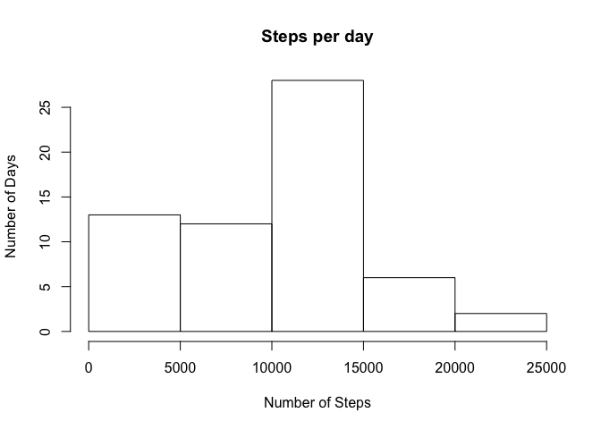
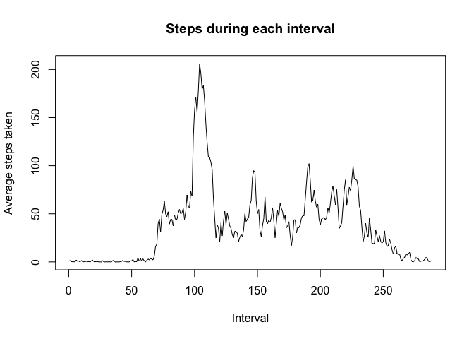
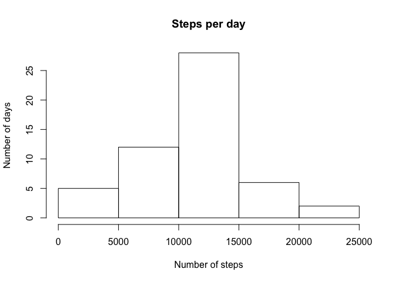
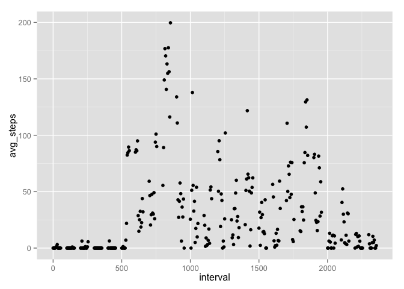

# Reproducible Research: Peer Assessment 1


## Loading and preprocessing the data
#### Download the data.

```r
fileUrl <- "https://d396qusza40orc.cloudfront.net/repdata%2Fdata%2Factivity.zip"
download.file(fileUrl, "repdata_data_activity.zip", method="curl")
```
#### Unzip the data. 

```r
unzip("repdata_data_activity.zip")
```
#### Read in the data

```r
activity_data <- read.csv("activity.csv")
```
#### Convert the "date" variable to date class.

```r
activity_data$date <- as.Date(activity_data$date)
```

## What is mean total number of steps taken per day?
#### Create a histogram of steps by day. 

```r
steps_by_day <- tapply(activity_data$steps, activity_data$date, FUN=sum, na.rm=TRUE)
hist(steps_by_day, main = "Steps per day", xlab = "Number of Steps", ylab= "Number of Days")
```

 

#### Calculate the mean and median steps per day. 

The mean of steps each day is 9354.2295082. 
The median of steps each day is 10395.

## What is the average daily activity pattern?
#### Create a time series plot.

```r
steps_by_interval <- tapply(activity_data$steps, activity_data$interval, FUN=mean, na.rm = TRUE)
plot(steps_by_interval, 
     type="l", 
     main="Steps during each interval", 
     xlab = "Interval", 
     ylab = "Average steps taken")
```

 
### Calculate the number of missing values in the data. 

```r
max_index <- activity_data$interval[which.max(steps_by_interval)]
```
The interval with the maximum number of steps
is 835.

## Imputing missing values

```r
NA_values <- is.na(activity_data$steps)
NA_count <- sum(NA_values)
```
There are 2304 missing values in the dataset. 

#### Replace the missing value with the mean for that interval. 
I am going to use the dplyr package as other solutions are too cumbersome at this point.

```r
library(dplyr)
```

```
## 
## Attaching package: 'dplyr'
## 
## The following objects are masked from 'package:stats':
## 
##     filter, lag
## 
## The following objects are masked from 'package:base':
## 
##     intersect, setdiff, setequal, union
```
Group the data by interval. 

```r
activity_data_grouped <- activity_data %>%
      group_by(interval) %>%
      summarize(mean_steps_per_day=mean(steps))
```
Fill in the dataset.

```r
activity_data_replaced <- activity_data
for (i in 1:nrow(activity_data_replaced)) {
      if (is.na(activity_data_replaced$steps[i])) {
            # Find the index value for when the interval matches the average
            index_value <- which(activity_data_replaced$interval[i] == activity_data_grouped$interval)
            # Assign the value to replace the NA
            activity_data_replaced$steps[i] <- activity_data_grouped[index_value,]$mean_steps_per_day
      }
}
```
Make sure the date is still a date. 

```r
activity_data_replaced$date <- as.Date(activity_data_replaced$date)
```

Plot a new histogram. 

```r
activity_data_replaced_by_day <- activity_data_replaced %>%
      group_by(date) %>%
      summarize(step_sum=sum(steps))

hist(activity_data_replaced_by_day$step_sum, 
     xlab = "Number of steps",
     ylab = "Number of days",
     main = "Steps per day")
```

 
Get the mean and median.


The mean is 1.0766189\times 10^{4} and the median is 1.0765\times 10^{4}. 
The mean and median appear to have shifted and become almost equal. The mean shift is likely the result of imputing a large number of values for the mean through dplyr. Dplyr may calculate means differently than the methods use previously. The median probably became close to equal to the mean because so many values for the mean were inserted into the data. 

## Are there differences in activity patterns between weekdays and weekends?
Make a new variable for the day of the week. 

```r
activity_data_replaced$day <- weekdays(activity_data_replaced$date)
```
Make days weekdays or weekends.

```r
activity_data_replaced$day_type <- "weekday"
activity_data_replaced$day_type[activity_data_replaced$day %in% c("Saturday", "Sunday")] <- "weekend"
```
Calculate average weekday steps versus weekend steps. 

```r
average_steps_per_day <- activity_data_replaced %>%
      group_by(interval,day) %>%
      summarize(avg_steps=mean(steps), na.rm=TRUE)
```
Let's make a plot to compare using ggplot2.

```r
library(ggplot2)
qplot(interval, avg_steps, data=average_steps_per_day,
      type ='l')
```

```
## Warning: Removed 1728 rows containing missing values (geom_point).
```

 
